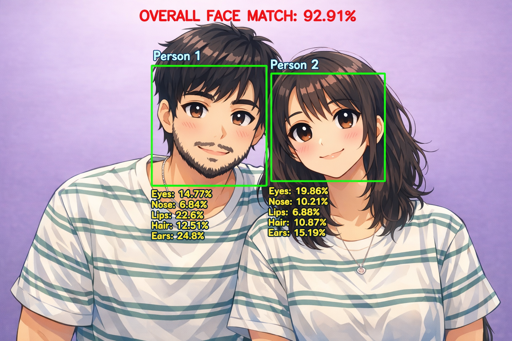

# FaceMatch AI Web Application

A modern AI-powered Face Match web application built using:

- HTML
- CSS
- JavaScript
- Node.js
- Express.js
- Python
- OpenCV

This application allows users to upload two face images and compare facial similarity using computer vision techniques.<br>
Note: Both the pictures must have same background to give more accurate data.<br>

<p align="center">
  
</p>

---

# Features

- Upload two face images
- AI-style face comparison
- Facial feature analysis
- Match percentage calculation
- Result image generation
- Professional modern UI
- Downloadable result image
- Node.js + Python integration

---

# Technologies Used

## Frontend
- HTML5
- CSS3
- JavaScript

## Backend
- Node.js
- Express.js
- Multer

## AI / Image Processing
- Python
- OpenCV
- NumPy

---

# Project Structure

```text
face-match-app/
│
├── server.js
├── face_match.py
├── package.json
├── uploads/
│
├── public/
│   ├── index.html
│   ├── style.css
│   ├── script.js
│   │
│   └── result_pic/
│       └── result.jpg
│
└── views/
    └── result.ejs
```

---

# Installation

## Install Node.js Packages

Open terminal inside project folder:

```bash
npm install
```

---

## Install Python Libraries

```bash
pip install opencv-python numpy
```

---

# How to Start the Server

Run the following command inside the project folder:

```bash
node server.js
```

If successful, terminal will show:

```text
SERVER RUNNING
http://localhost:3000
```

---

# Open in Browser

Visit:

```text
http://localhost:3000
```

---

# How It Works

1. User uploads two images
2. Node.js receives files
3. Node.js executes Python script
4. Python detects faces using OpenCV
5. Facial regions are analyzed
6. Similarity score is calculated
7. Result image is generated
8. Final result is displayed on website

---

# Facial Features Compared

- Eyes
- Nose
- Lips
- Hair
- Jaw Structure

---

# Result Output

The generated result image is stored at:

```text
public/result_pic/result.jpg
```

---

# Requirements

- Node.js
- Python 3.x
- OpenCV
- NumPy

---

# Future Improvements

- DeepFace AI integration
- Real-time webcam detection
- FaceNet support
- User login system
- Database storage
- Cloud deployment
- Mobile responsive improvements

---
